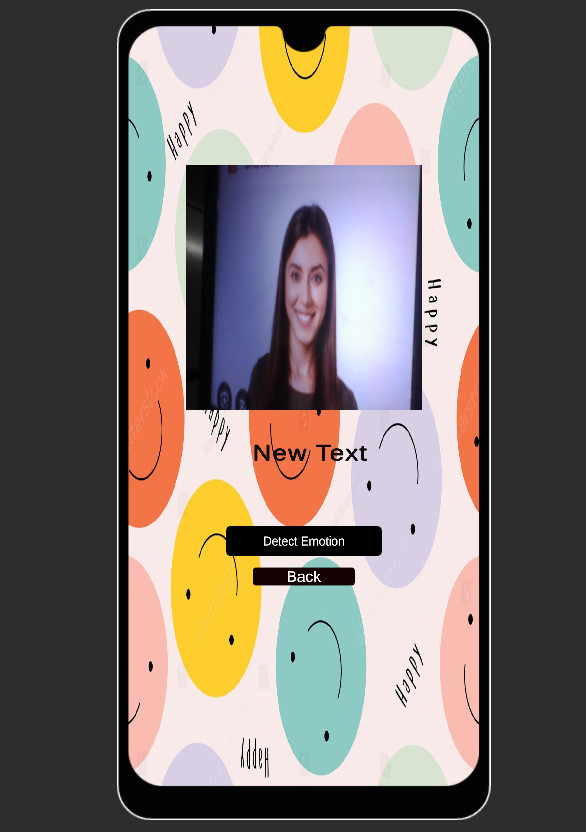
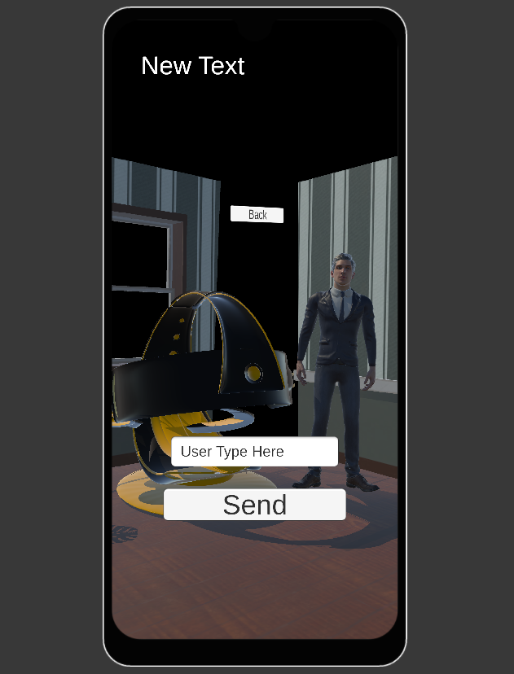
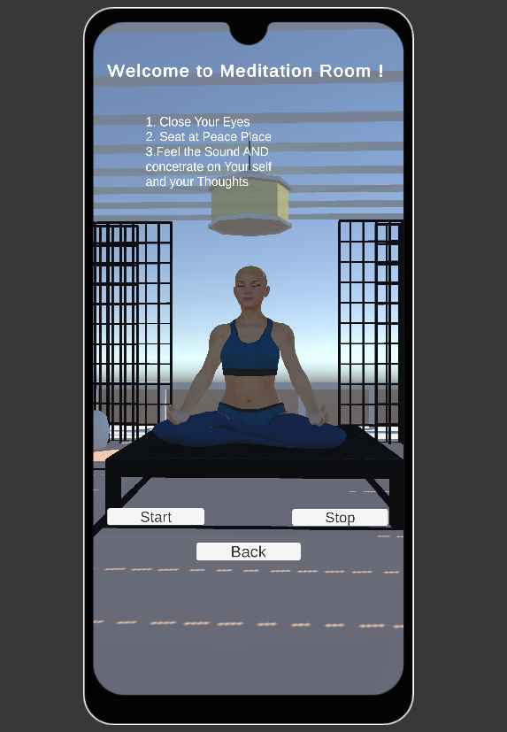
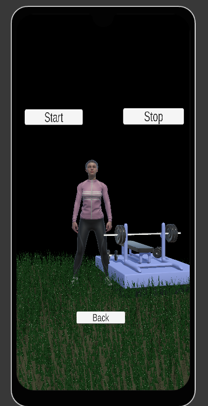

# 🌈 Happiness Unlimited – AR/VR Powered Mental Health App 🧠

🚀 *Introducing "Happiness Unlimited"* – an immersive **AR/VR Unity app** designed to promote **emotional wellness** and **mental clarity** in an engaging, tech-driven way.

---

## ✨ Overview

Proudly built as an **innovative group project**, *Happiness Unlimited* combines Unity's interactive power with **MediaPipe emotion detection**, creating a digital sanctuary to help users manage stress, anxiety, and fatigue.

---


## 🎮 Key Features

### 🎲 1. Relaxing Mini-Games (AR-Based)

- **Infinite Runner** – Dodge incoming obstacles to stay sharp and focused.
- **Ball Collection Game** – Guide a rolling ball on an AR plane, collect rewards, and stay engaged.

> 🎯 *Mood-lifting gameplay designed to offer quick mental refreshment.*

---

### 📸 2. Emotion-Based Assessment & Chatroom

- **Real-Time Emotion Detection**  
  Uses Python + MediaPipe to analyze facial expressions (😊 | 😐 | 😞).

- **AR Chat Counseling Room**  
  Sit in a virtual room with a 3D AI counselor. Your typed input is processed via a Flask chatbot and responded to by an animated NPC psychiatrist.

> 🧠 *Smart emotional support adapted to how you feel in real-time.*

---

### 🌿 3. AR/VR Counseling Activities

- 🧘 **Meditation Room** – Avatar guides you through breathing sessions with synced lighting & music.
- 💪 **Physical Trainer** – Learn squats and sit-ups from an animated avatar, complete with voice prompts and smooth Mixamo transitions.
- 🦋 **Virtual Garden** – Hand gestures summon butterflies. Open palm = fly, closed = pause.

> ✨ *Blending technology with tranquility for inner peace.*

---

## 🧰 Tech Stack

| Frontend (Unity) | Backend (Python) | Assets & Tools |
|------------------|------------------|----------------|
| Unity (C#)       | Flask            | Sketchfab 3D models |
| AR Foundation    | MediaPipe        | Mixamo animations  |
| Canvas UI        | REST API         | TextMeshPro UI    |

---

## 🎯 Purpose

Designed with **mental well-being** at its core, *Happiness Unlimited* is a step toward making **mental health care more immersive, gamified, and accessible**.

---

## 🤝 Team Credits

Special thanks to my amazing teammates for their passion and creativity:

- **Janhavi Deore**
- **Gourav Chouhan**
- **Sanket Patil**
- **Mital Patil** *(Project Lead)*

---

## 📸 Demo & Screenshots

[Download & Watch Demo Video](media/video.mp4)

  

  






---

## 📌 Installation Instructions

1. Clone the repository:
   ```bash
   git clone https://github.com/17mital/Mental_Health_ARVR_App.git
2. Open in Unity 2022 or later.

3. Connect Android device (if using AR).

4. Press Play or Build to run on device.

5. Ensure Python backend is running:
  ```bash
   python app.py
